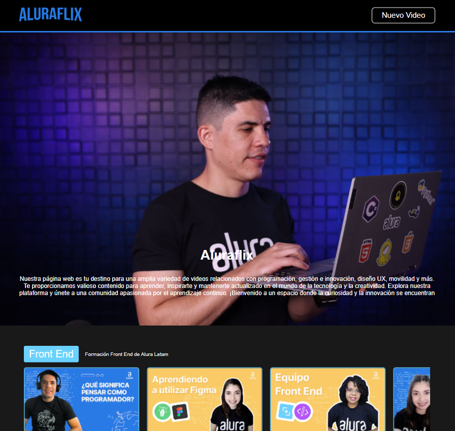
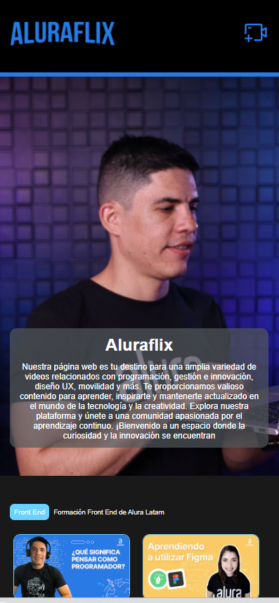

# AluraFlix - Aplicación de Video

## Descripción
AluraFlix es una plataforma diseñada para ser el Netflix de Alura, una plataforma de aprendizaje en línea enfocada en programación y tecnología. La principal función de AluraFlix es proporcionar a los usuarios recomendaciones de videos relacionados con sus intereses educativos, así como permitirles agregar nuevas categorías y videos a la plataforma.

En esta primera Sprint, el enfoque está en la construcción de los componentes esenciales que ayudarán a estructurar la aplicación. Los componentes que se deben crear incluyen:

Botón
Header (Encabezado)
Banner
Footer (Pie de página)
Componente Default
Slider (Deslizador)
Carrusel
Campo de Texto

## Capturas
 

## Tecnologías Utilizadas

El proyecto AluraFlix fue desarrollado utilizando las siguientes tecnologías:

- [React](https://reactjs.org/): Una biblioteca de JavaScript para construir interfaces de usuario.
- [Styled Components](https://styled-components.com/): Recomendamos usar la biblioteca de Styled Components que se puede instalar fácilmente en tu proyecto.
- [Material UI](https://mui.com/): También puedes usar Material UI en algunas partes de tu proyecto, si lo consideras necesario.

